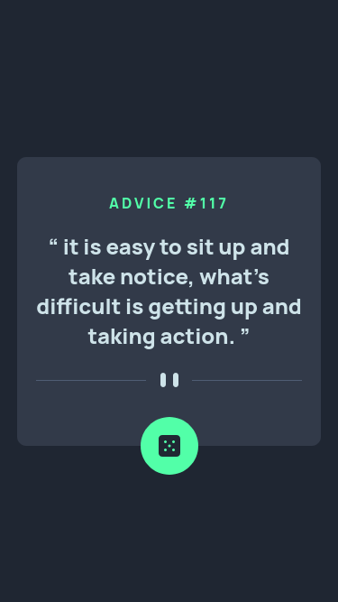
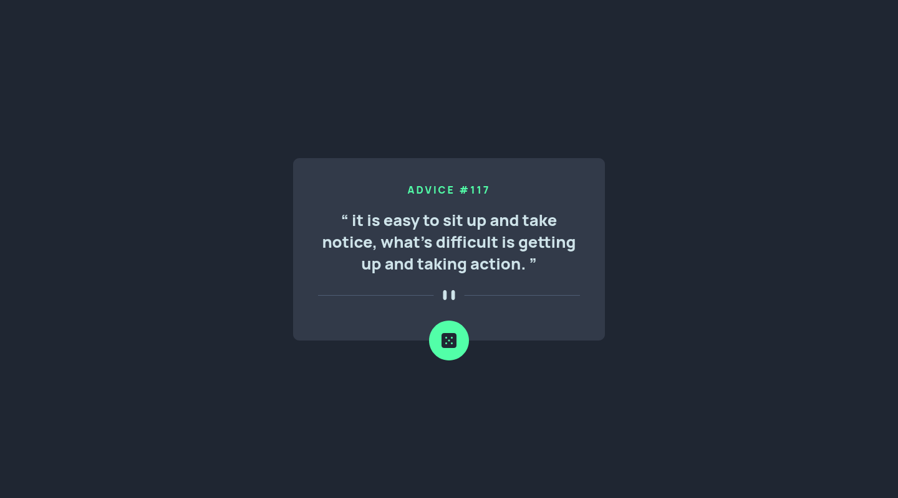
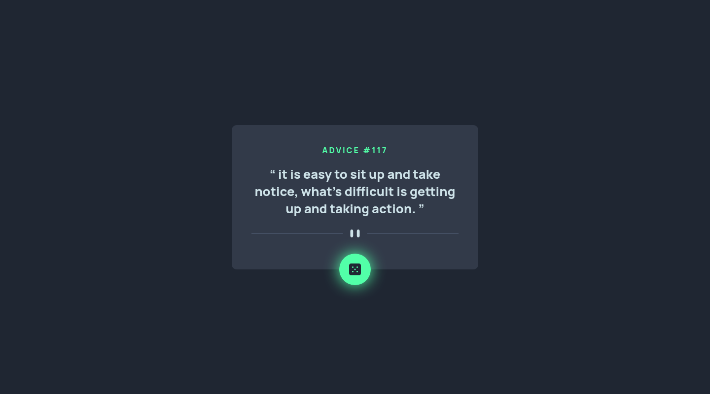

# Frontend Mentor - Advice generator app solution

This is a solution to the [Advice generator app challenge on Frontend Mentor](https://www.frontendmentor.io/challenges/advice-generator-app-QdUG-13db). Frontend Mentor challenges help you improve your coding skills by building realistic projects.

## Table of contents

- [Overview](#overview)
  - [The challenge](#the-challenge)
  - [Screenshot](#screenshot)
  - [Links](#links)
- [My process](#my-process)
  - [Built with](#built-with)
  - [What I learned](#what-i-learned)
  - [Continued development](#continued-development)
- [Author](#author)

## Overview

### The challenge

Users should be able to:

- View the optimal layout for the app depending on their device's screen size
- See hover states for all interactive elements on the page
- Generate a new piece of advice by clicking the dice icon

### Screenshot





### Links

- Solution URL: [solution URL](https://www.frontendmentor.io/solutions/advice-generator-app-using-html-css-and-js-with-the-adviceslip-api-FP0FKv4Adz)
- Live Site URL: [live site URL](https://yassine-ramla.github.io/Frontend-Mentor_Advice-generator-app/)

## My process

### Built with

- Semantic HTML5 markup
- CSS custom properties
- Flexbox
- Mobile-first workflow

### What I learned

this challenge was new for me, this was the first time i deal with API's, i've also learnt something which is browsers doesn't treat api requests the same, for exmple in this challenge, chrome generate a new advice everytime the dice is clicked while firefox generate a new advice just once unless you are in the private mode.
to solve this problem i've added a cache-busting parameter to the API request URL:

```html
<section>
  <q id="advice"></q>
</section>
```

```js
const timestamp = new Date().getTime();
request.open("GET", `https://api.adviceslip.com/advice?time=${timestamp}`);
```

## Author

- Frontend Mentor - [@yassine-ramla](https://www.frontendmentor.io/profile/yassine-ramla)
- Twitter - [@yassine_ramla](https://www.twitter.com/yassine_ramla)